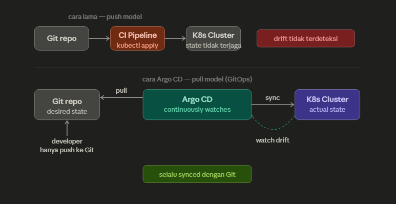
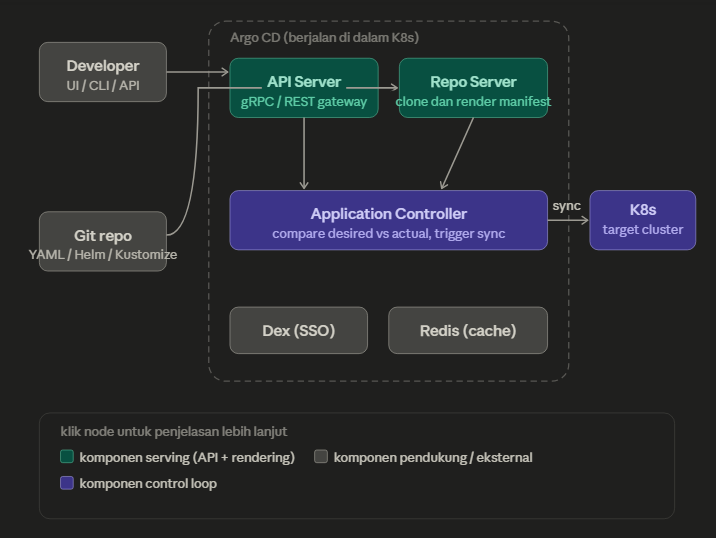
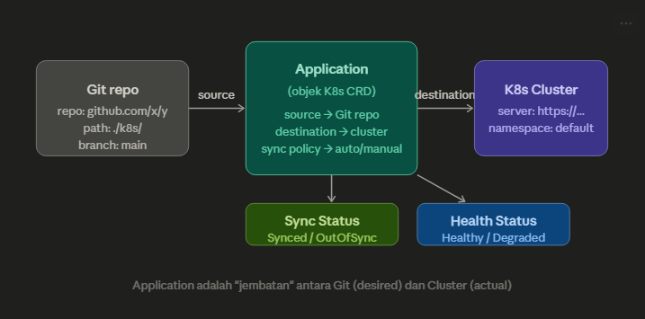
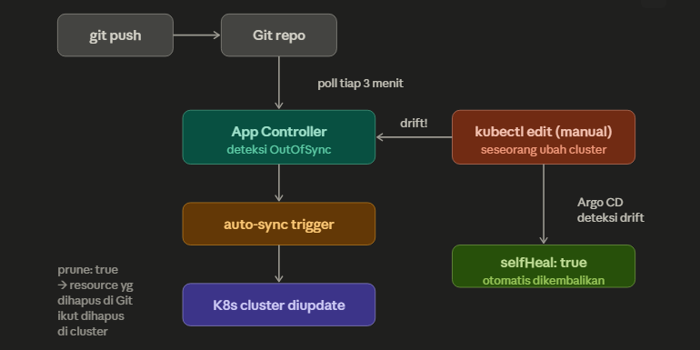

# ArgoCD
Argo CD adalah sebuah GitOps continuous delivery tool untuk Kubernetes. Sebelum ke detailnya, kita pahami dulu masalah yang dia selesaikan.

### Masalah sebelum Argo CD
Cara lama deploy ke K8s: developer push code → CI pipeline build → lalu seseorang (atau script) jalankan kubectl apply dari luar cluster. Ini model "push" — artinya ada pihak eksternal yang aktif mendorong perubahan ke cluster. Masalahnya: tidak ada yang menjaga apakah kondisi cluster tetap sesuai dengan yang seharusnya. Kalau ada yang iseng kubectl edit langsung di production, tidak ada yang tahu.
Argo CD hadir dengan pendekatan berbeda: GitOps. Git adalah satu-satunya sumber kebenaran. Argo CD yang aktif "menarik" dan memastikan cluster selalu sinkron dengan Git — bukan sebaliknya.


Sekarang kita lihat bagaimana Argo CD bekerja secara internal — komponen apa saja yang ada di dalamnya:

- Penjelasan tiap komponen
API Server — pintu masuk utama. Menerima request dari UI web, CLI (argocd command), atau CI pipeline. Semua operasi (sync, create app, dll) lewat sini.
Repo Server — "tukang clone". Tugasnya mengambil manifest dari Git, lalu me-render-nya menjadi plain YAML siap pakai — entah itu raw YAML, Helm chart, atau Kustomize. Hasilnya dikirim ke Application Controller.
Application Controller — ini jantungnya. Dia terus-menerus membandingkan dua hal: desired state (yang ada di Git) vs actual state (yang beneran jalan di cluster). Kalau beda → dia trigger sync. Inilah yang membuat cluster selalu konsisten.
Dex — komponen SSO opsional untuk integrasi login (GitHub, LDAP, Google, dll).
Redis — cache untuk menyimpan hasil perbandingan state supaya tidak harus query cluster terus-menerus.


Konsep penting yang perlu dipahami
Application — objek utama di Argo CD. Ini adalah "definisi" yang mengatakan: "ambil manifest dari Git repo X, branch Y, path Z — lalu deploy ke namespace N di cluster ini."
Sync status ada dua kondisi:

Synced → cluster sudah sesuai dengan Git
OutOfSync → ada perbedaan, perlu di-sync

Health status juga ada dua:

Healthy → semua resource berjalan normal
Degraded / Progressing → ada yang bermasalah

Sync policy bisa diset manual (kamu yang pencet sync) atau auto-sync (Argo CD langsung sync begitu ada perubahan di Git).

Oke, kita bahas urut dari fundamental dulu sebelum hands-on. Mari mulai dari konsep yang wajib kamu pahami:
1. Konsep inti: apa itu "Application" di Argo CD?

Application di Argo CD adalah sebuah Custom Resource (CRD) yang mendefinisikan 3 hal utama: dari mana manifest diambil (Git), ke mana di-deploy (cluster + namespace), dan bagaimana cara sync-nya (manual atau otomatis).
2. Apa yang disimpan di Git repo
Di Git kamu cukup simpan manifest Kubernetes biasa — tidak ada yang spesial:
```bash
my-app/
├── k8s/
│   ├── deployment.yaml     ← Deployment biasa
│   ├── service.yaml        ← Service biasa
│   ├── configmap.yaml      ← ConfigMap biasa
│   └── secret.yaml         ← Secret (atau pakai Sealed Secrets)
└── (Dockerfile, src/, dll — opsional, bisa repo sama)
```
Argo CD mendukung 3 format manifest: raw YAML, Helm chart, dan Kustomize. Kamu sudah punya raw YAML dari latihan tadi, jadi langsung bisa dipakai.

3. Install Argo CD di k3s
```bash
# Buat namespace khusus untuk Argo CD
kubectl create namespace argocd

# Install Argo CD (stable release)
kubectl apply -n argocd -f https://raw.githubusercontent.com/argoproj/argo-cd/stable/manifests/install.yaml

# Tunggu semua pod Running (bisa 2-3 menit)
kubectl get pods -n argocd -w
```

4. Setelah semua pod Running, akses UI-nya:
```bash
# Ekspos UI via NodePort (cocok untuk k3s lokal)
kubectl patch svc argocd-server -n argocd \
  -p '{"spec": {"type": "NodePort"}}'

# Cek port yang diberikan
kubectl get svc argocd-server -n argocd
# Lihat kolom PORT(S) → misal 80:32080/TCP

# Ambil initial password
kubectl get secret argocd-initial-admin-secret \
  -n argocd \
  -o jsonpath="{.data.password}" | base64 -d && echo

# Login: buka browser → http://<NODE-IP>:<NODEPORT>
# Username: admin
# Password: hasil command di atas
```

5. Install Argo CD CLI
```bash
# Download CLI (sesuaikan versi terbaru)
curl -sSL -o argocd-linux-amd64 \
  https://github.com/argoproj/argo-cd/releases/latest/download/argocd-linux-amd64

chmod +x argocd-linux-amd64
sudo mv argocd-linux-amd64 /usr/local/bin/argocd

# Verifikasi
argocd version
```
```bash
# Login via CLI
argocd login <NODE-IP>:<NODEPORT> \
  --username admin \
  --password <password-dari-tadi> \
  --insecure   # karena belum pakai TLS
```

6. Buat Application pertama
Pertama, pastikan manifest app-api kamu sudah ada di Git repo. Struktur yang direkomendasikan:
```bash
github.com/username/my-k8s-apps/
└── app-api/
    ├── deployment.yaml
    ├── service.yaml
    ├── configmap.yaml
    └── secret.yaml
```
Buat Application via YAML (cara paling proper karena ikut prinsip GitOps):
```bash
# argocd-app-api.yaml
apiVersion: argoproj.io/v1alpha1
kind: Application
metadata:
  name: app-api
  namespace: argocd          # Application object selalu di namespace argocd
spec:
  project: default

  source:
    repoURL: https://github.com/username/my-k8s-apps
    targetRevision: main      # branch yang dipantau
    path: app-api             # folder manifest di dalam repo

  destination:
    server: https://kubernetes.default.svc   # cluster lokal (in-cluster)
    namespace: default        # namespace tujuan deploy

  syncPolicy:
    syncOptions:
      - CreateNamespace=true  # buat namespace otomatis jika belum ada
```
```bash
# Apply Application object-nya
kubectl apply -f argocd-app-api.yaml

# Cek status
argocd app get app-api
```
Sekarang lihat di UI — app akan muncul dengan status OutOfSync (belum di-sync pertama kali) atau Synced jika sudah match.

7. Setup Auto-Sync
Ini bagian paling powerful dari Argo CD. Tambahkan automated ke syncPolicy:
```bash
syncPolicy:
    automated:
      prune: true        # hapus resource yang sudah tidak ada di Git
      selfHeal: true     # kembalikan ke Git state jika ada yang berubah manual di cluster
    syncOptions:
      - CreateNamespace=true
```

Dua opsi automated yang wajib dipahami:
selfHeal: true — kalau ada yang iseng kubectl edit langsung di cluster, Argo CD akan mengembalikannya sesuai Git dalam hitungan detik. Ini menjaga cluster tidak bisa "drift" dari Git.
prune: true — kalau kamu hapus file YAML dari Git, resource-nya di cluster ikut dihapus. Tanpa ini, resource lama akan tetap hidup meski sudah tidak ada di Git.

8. Perintah CLI yang sering dipakai
```bash
# Lihat semua aplikasi
argocd app list

# Detail status satu app
argocd app get app-api

# Sync manual (kalau auto-sync mati)
argocd app sync app-api

# Lihat history sync
argocd app history app-api

# Rollback ke revision sebelumnya
argocd app rollback app-api <REVISION-ID>

# Hapus aplikasi (tidak menghapus resource di cluster)
argocd app delete app-api

# Hapus aplikasi + semua resource di cluster
argocd app delete app-api --cascade
```
Urutan belajar selanjutnya
Setelah ini running, topik yang direkomendasikan untuk dipelajari berikutnya:

Projects — cara mengelompokkan Application dan membatasi akses repo/cluster per tim
App of Apps pattern — satu Application yang mendeploy Application lain (untuk multi-service)
Image Updater — plugin Argo CD yang otomatis update image tag di Git saat ada image baru di registry
Notifications — kirim alert ke Slack/email saat sync gagal atau app Degraded
