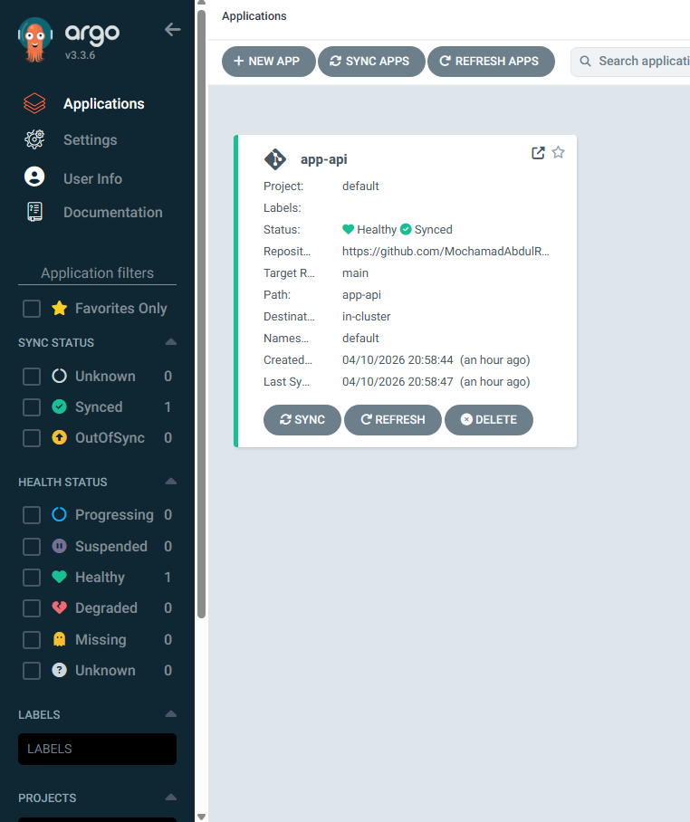
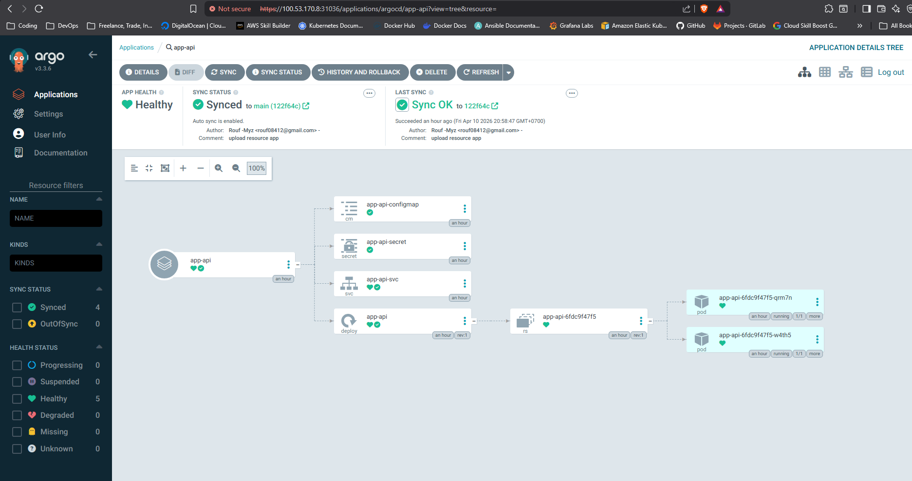

# Deploymemt App using ArgoCD Dashboard

1. Dapatkan password Login

Cara dapat password:
kubectl get secret argocd-initial-admin-secret -n argocd -o jsonpath="{.data.password}" | base64 -d && echo

Setelah login pertama, ganti password lewat: User Info → Update Password (pojok kiri bawah)

2. Klik tombol + New App di pojok kanan atas. Ini akan membuka form wizard untuk membuat Application baru.
3. Isi list form yang di perlukan untuk melakukan deployment

- Application Name — nama bebas, tapi biasanya sama dengan nama app-nya.

- Project — gunakan default dulu. Project dipakai untuk grouping dan RBAC nanti.

- Sync Policy: Automatic — centang keduanya:
• Prune Resources = hapus resource yang sudah tidak ada di Git
• Self Heal = kembalikan otomatis jika ada yang diubah manual di cluster

- Repository URL — URL repo Git kamu. Kalau private, kamu perlu connect repo dulu via Settings → Repositories → Connect Repo sebelum langkah ini.

- Revision — branch yang dipantau. Argo CD akan poll branch ini tiap ~3 menit.

- Path — folder di dalam repo yang berisi YAML manifest. Kalau YAML-nya di root, isi dengan .

- Cluster URL — karena Argo CD berjalan di cluster yang sama dengan app-api kamu, gunakan https://kubernetes.default.svc (in-cluster).

- Namespace — namespace tujuan deploy. Harus sesuai dengan yang ada di manifest YAML kamu.

- Klik Create — Application akan langsung terbuat dan mulai proses sync pertama.

Synced + Healthy = deployment berhasil! Argo CD sudah sinkron dengan Git.

4. Klik nama aplikasi untuk lihat resource tree — kamu bisa lihat Deployment, ReplicaSet, Pod, Service, semua dalam satu grafik.

Mulai sekarang: setiap kali kamu git push ke repo, Argo CD akan otomatis deploy dalam ~3 menit.

- Hasil akhir:



- Server
```bash
ubuntu@master-node:~$ k get all -n default
NAME                           READY   STATUS    RESTARTS   AGE
pod/app-api-6fdc9f47f5-qrm7n   1/1     Running   0          78m
pod/app-api-6fdc9f47f5-w4th5   1/1     Running   0          78m

NAME                  TYPE        CLUSTER-IP      EXTERNAL-IP   PORT(S)        AGE
service/app-api-svc   NodePort    10.43.108.216   <none>        80:30010/TCP   78m
service/kubernetes    ClusterIP   10.43.0.1       <none>        443/TCP        5d5h

NAME                      READY   UP-TO-DATE   AVAILABLE   AGE
deployment.apps/app-api   2/2     2            2           78m

NAME                                 DESIRED   CURRENT   READY   AGE
replicaset.apps/app-api-6fdc9f47f5   2         2         2       78m
ubuntu@master-node:~$
```
